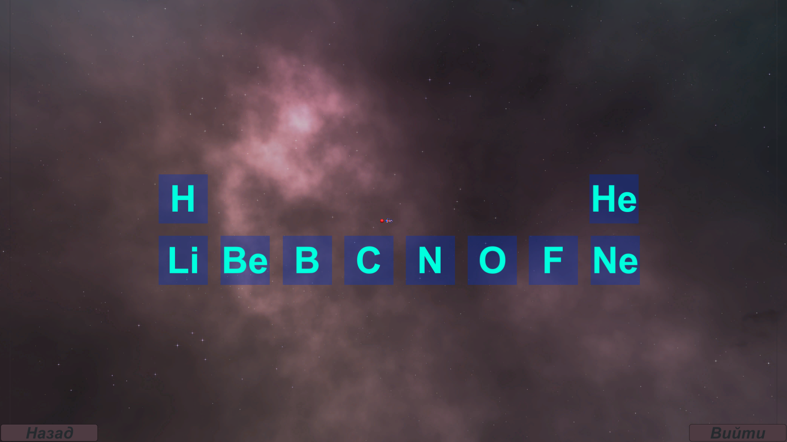
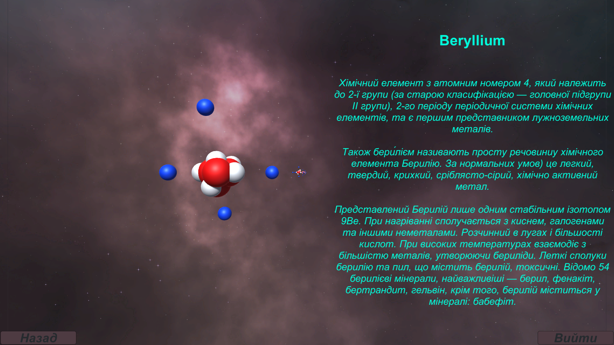
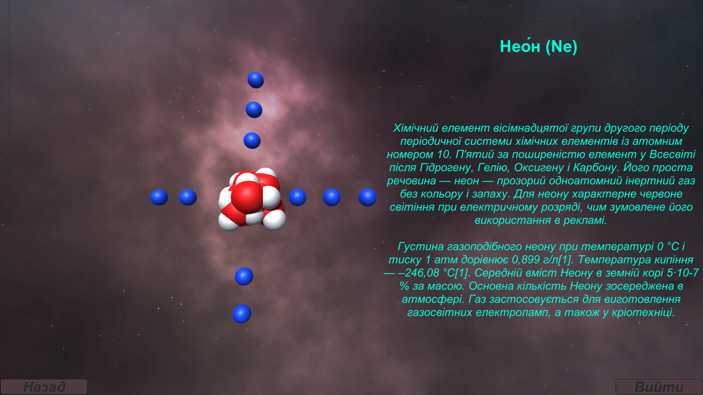

    <b align ="center"><h1 align ="center">Chemistry Table</h1></b>

This a small chemistry table for learn chemical elements
 

   
   
   

## Table of Contents
1. [Introduction](#Introduction)
2. [Preview of work](#Preview-of-work)
3. [How to install](#How-to-install)
4. [Where take .exe file](#Where-take-exe-file)

## <a name="Introduction">Introduction</a>
This is a project that includes a part of the periodic table. Where you can learn interesting and basic information about chemical elements. And also see their physical structure.

A great app for school to study the chemical table in class.

## <a name="Preview-of-work">Preview of work</a>

 Images

  

    

    

## <a name="How-to-install">How to install</a>
* Download project
* Open project in Unity
* Use project.

## <a name="Where-take-exe-file">Where take .exe file</a>
* Download project
* Find Build.zip
* Extract where you need
* Use .exe file

